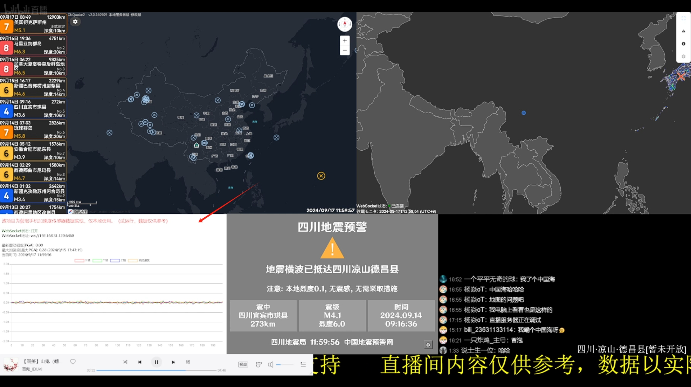

# 一个用通义AI写的，改了很多遍的屎山代码（全是AI写的）
## 使用教程：
首先你想要有一台闲置的手机和一台有宝塔面板的服务器
下载zip文件
解压到服务器
ws文件夹就是Websocket，使用Node部署他
其余文件直接点宝塔的添加站点部署（我都是放一个文件夹里的，ws和html  *owo）
## 介绍：
index.html是手机端打开的
webui.html是接收端
使用时务必更改Websocket的IP，*index.html和webui里的代码
最后用手机浏览器打开你的index.html所在IP即可 如：如: 192.168.1.45:1145/index.html
再在电脑上打开 如: 127.0.0.1:1145/webui.html 就可以看到手机的数据啦！
如果显示Websocket连接失败请检查Websocket是否正常（手机、电脑均有提示）
## 截图：

